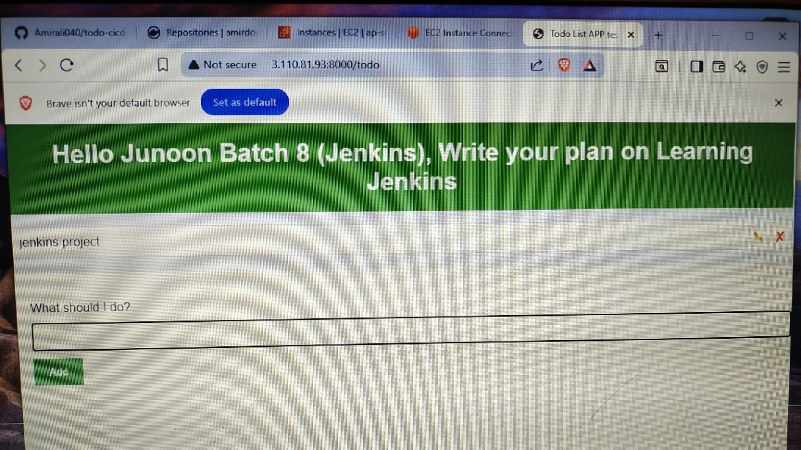
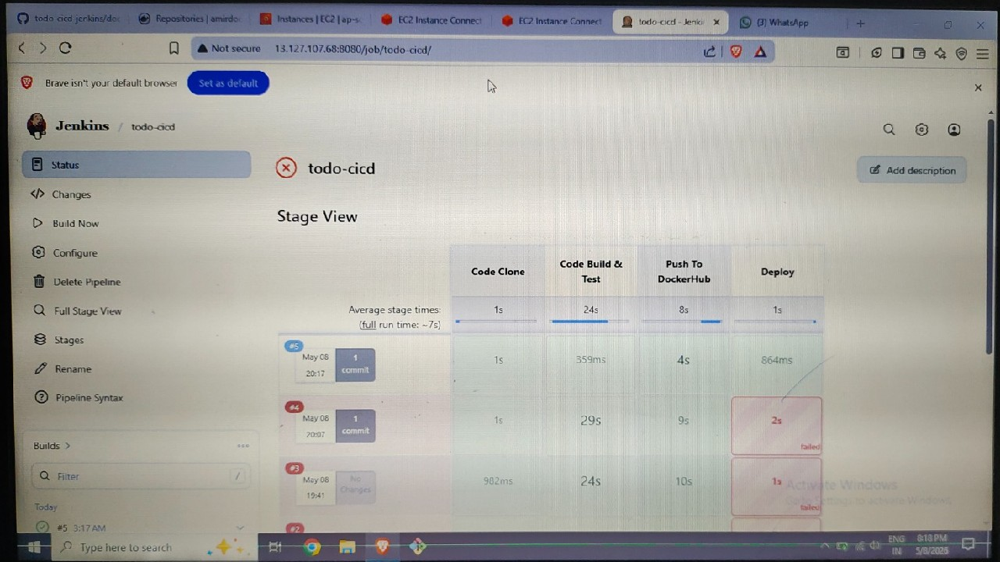
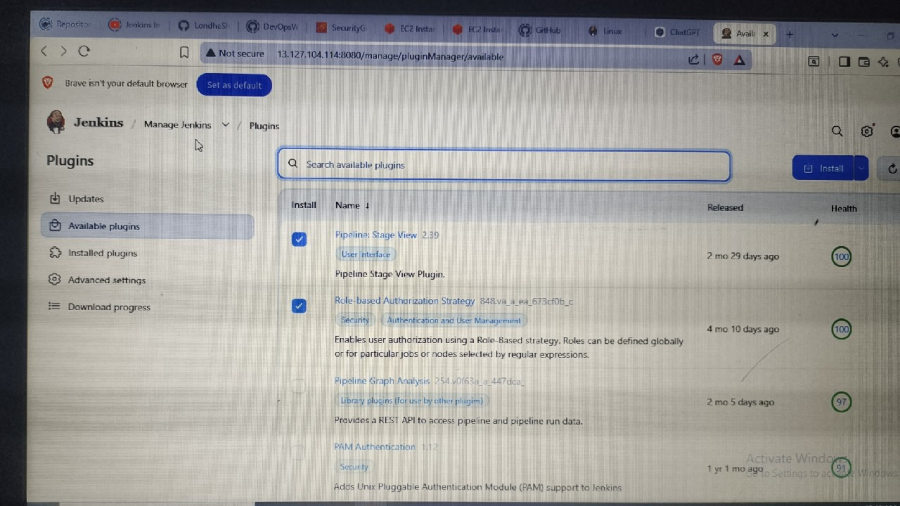
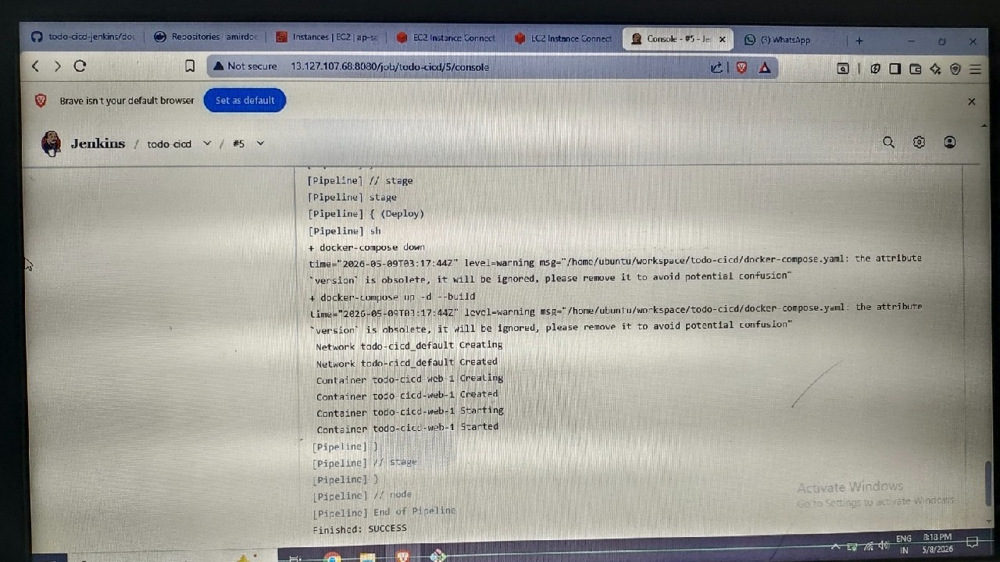

# Todo-cicd

Run these commands:

`sudo apt install nodejs`

`sudo apt install npm`

`npm install`

`node app.js`

or Run by docker compose test

# Todo CICD Jenkins Project

A Django Todo application deployed using Jenkins CI/CD pipeline, Docker, DockerHub, and Docker Compose on AWS EC2.

---

# Technologies Used

- Python
- Django
- Jenkins
- Docker
- Docker Compose
- DockerHub
- AWS EC2
- GitHub

---

# Features

✅ Jenkins Pipeline Automation

✅ Docker Image Build

✅ Push Docker Image to DockerHub

✅ Docker Compose Deployment

✅ Automatic Container Run on Port 8000

✅ CI/CD Workflow

---

# Jenkins Pipeline Stages

1. Code Clone
2. Build & Test
3. Push Docker Image to DockerHub
4. Deploy Using Docker Compose

---

# Project Screenshots

## Todo Application Running

---

## Jenkins Pipeline Stage View

---

## Jenkins Credentials Setup

---

## Jenkins Plugins Installation

---

## Jenkins Logs Output

